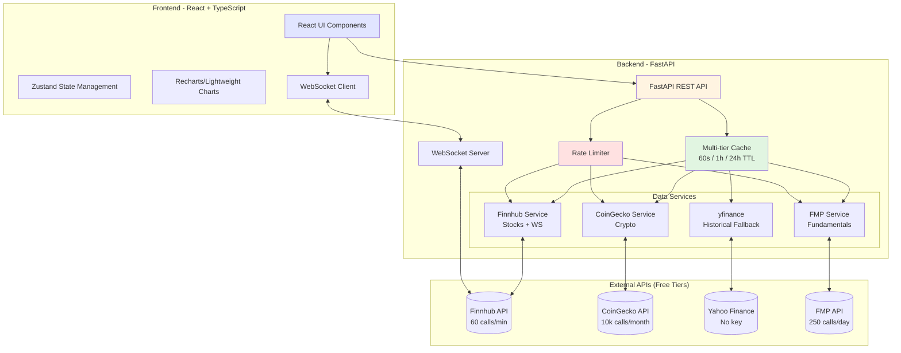

# Market Monitor

A personal finance and trading research application for monitoring stocks and cryptocurrencies, analyzing historical data, and generating trading ideas. Built with FastAPI backend and React + TypeScript frontend, integrating multiple free-tier financial data APIs.


## ✨ Features

- 📊 **Real-time Monitoring**: Track live prices of stocks and cryptocurrencies with auto-refresh
- 📈 **Historical Analysis**: View and interact with historical OHLCV candlestick data
- 🔍 **Smart Screening**: Filter securities by price changes, volume spikes, and technical indicators
- 🎯 **Trading Ideas**: Automated screening with RSI, MACD, SMA crossovers, and momentum signals
- 📱 **Modern UI**: Clean, responsive single-page React application with TailwindCSS
- 🌐 **WebSocket Support**: Real-time price updates via WebSocket connections
- ⚡ **Intelligent Caching**: Multi-tiered caching strategy to minimize API calls
- 🛡️ **Rate Limit Protection**: Built-in rate limiting to stay within free-tier quotas

## 🏗️ Architecture



### Data Flow

1. **Frontend Request** → React component requests data via REST API
2. **Cache Check** → Backend checks multi-tier cache (quotes: 60s, historical: 1h, fundamentals: 24h)
3. **Rate Limit Check** → If not cached, verify rate limits before calling external API
4. **API Fallback** → Primary API (Finnhub/CoinGecko) → Fallback (yfinance/FMP) on error
5. **Response & Cache** → Data cached with appropriate TTL, returned to frontend
6. **WebSocket Stream** → Real-time quotes streamed via WS for live monitoring

### Tech Stack Summary

| Layer | Technology | Purpose |
|-------|-----------|---------|
| **Frontend** | React 19 + TypeScript | UI components and state |
| | Vite | Fast dev server and bundling |
| | TailwindCSS | Utility-first styling |
| | Zustand | Lightweight state management |
| | Recharts | Financial charts and visualizations |
| **Backend** | FastAPI 0.109 | Async-first REST API |
| | Uvicorn | ASGI server |
| | Pydantic v2 | Type-safe data validation |
| | httpx | Async HTTP client |
| | cachetools | TTL-based in-memory caching |
| **Data Sources** | Finnhub | Stock quotes, WebSocket, news |
| | CoinGecko | Crypto prices and market data |
| | yfinance | Historical data fallback |
| | FMP | Fundamentals and financials |
| **Testing** | pytest + httpx | Backend integration tests |
| | Vitest + Testing Library | Frontend component tests |

---

## 🚀 Quick Start

### Prerequisites

- **Python 3.11+** (backend)
- **Node.js 18+** and npm (frontend)
- Free API keys (see [API Key Setup](#-api-key-setup) below)

### 1. Clone Repository

```bash
git clone <repository-url>
cd market-monitor
```

### 2. Backend Setup

```bash
cd backend

# Create virtual environment
python -m venv venv
source venv/bin/activate  # On Windows: venv\Scripts\activate

# Install dependencies
pip install -r requirements.txt

# Configure environment
cp .env.example .env
# Edit .env and add your API keys (see API Key Setup section)

# Run backend
uvicorn main:app --host 0.0.0.0 --port 8000 --reload
```

Backend will be available at:
- API: http://0.0.0.0:8000
- Interactive Docs: http://0.0.0.0:8000/docs
- Health Check: http://0.0.0.0:8000/health

### 3. Frontend Setup

```bash
cd frontend

# Install dependencies
npm install

# Run dev server
npm run dev
```

Frontend will be available at http://localhost:3000 (or the URL shown in terminal)

---

## 🔑 API Key Setup

All APIs below offer **free tiers** suitable for personal use. Sign up and add keys to `backend/.env`.

### Stock Data APIs

#### 1. Finnhub (Primary - Stocks + WebSocket)

**Sign up:** https://finnhub.io/register

**Free Tier (2026):**
- ~60 API calls/minute
- WebSocket real-time US stock quotes
- Company news and press releases
- Basic fundamentals

**Setup:**
```bash
# In backend/.env
FINNHUB_API_KEY=your_finnhub_api_key_here
```

**Rate Limits:**
- REST: 60 calls/min
- WebSocket: 1 connection, unlimited symbols

---

#### 2. Financial Modeling Prep (FMP)

**Sign up:** https://site.financialmodelingprep.com/developer/docs

**Free Tier (2026):**
- 250 API calls/day
- Historical stock prices (daily)
- Company fundamentals and financials
- Stock screener

**Setup:**
```bash
# In backend/.env
FMP_API_KEY=your_fmp_api_key_here
```

**Rate Limits:**
- 250 calls/day
- Rate limited to ~5 calls/second

---

#### 3. Alpha Vantage (Backup)

**Sign up:** https://www.alphavantage.co/support/#api-key

**Free Tier (2026):**
- 25 API calls/day (very limited)
- Technical indicators
- Forex and crypto support

**Setup:**
```bash
# In backend/.env
ALPHA_VANTAGE_API_KEY=your_alpha_vantage_api_key_here
```

**Rate Limits:**
- 25 calls/day
- 5 calls/minute

---

### Crypto Data APIs

#### 1. CoinGecko (Primary - Crypto)

**Sign up:** https://www.coingecko.com/en/api/pricing

**Free "Demo" Tier (2026):**
- 30-50 API calls/minute
- 10,000 calls/month
- 18,000+ cryptocurrencies
- Real-time prices and market data
- Historical OHLCV candles

**Setup:**
```bash
# In backend/.env
COINGECKO_API_KEY=your_coingecko_api_key_here
```

**Rate Limits:**
- 30-50 calls/minute
- 10,000 calls/month total
- Up to 365 days historical data

---

#### 2. Binance (No Key Required)

**Public API:** https://binance-docs.github.io/apidocs/

**Free Tier (2026):**
- No API key required for market data
- 1200 requests/minute (weight system)
- WebSocket for real-time prices
- Used via CCXT library

**Setup:**
```bash
# No API key needed for public endpoints
# Will be used automatically via CCXT
```

**Rate Limits:**
- Weight-based system: 1200 weight/min
- Most endpoints: 1-2 weight per call
- WebSocket: No rate limits

---

### yfinance (No Key Required)

**Library:** https://github.com/ranaroussi/yfinance

**Free Tier (2026):**
- No API key needed (scrapes Yahoo Finance)
- Unlimited requests (within reason)
- Historical stock data (adjusted for splits/dividends)
- **Warning:** Unofficial API, can break when Yahoo changes HTML

**Setup:**
```bash
# No setup needed - already in requirements.txt
# Will be used as fallback automatically
```

**Known Issues:**
- Not an official API (web scraping)
- Can break with Yahoo Finance updates
- Rate limiting at IP level (unclear limits)
- **Fallback strategy:** Use Finnhub/FMP if yfinance fails

---

### Example `.env` File

```bash
# Copy from backend/.env.example
cd backend
cp .env.example .env
```

Edit `.env` and add your keys:

```bash
# Application Settings
APP_ENV=development
APP_HOST=0.0.0.0
APP_PORT=8000
LOG_LEVEL=INFO

# CORS Settings
CORS_ORIGINS=http://localhost:3000,http://192.168.64.15:3000

# Stock Data APIs
FINNHUB_API_KEY=your_finnhub_key_from_signup
FMP_API_KEY=your_fmp_key_from_signup
ALPHA_VANTAGE_API_KEY=your_alphavantage_key_from_signup
TWELVE_DATA_API_KEY=  # Optional

# Crypto Data APIs
COINGECKO_API_KEY=your_coingecko_key_from_signup

# Cache TTL (seconds) - adjust as needed
CACHE_TTL_QUOTES=60          # 1 minute for real-time quotes
CACHE_TTL_HISTORICAL=3600    # 1 hour for historical data
CACHE_TTL_FUNDAMENTALS=86400 # 24 hours for company fundamentals

# Rate Limiting
RATE_LIMIT_ENABLED=true
RATE_LIMIT_CALLS_PER_MINUTE=50

# WebSocket Settings
WS_PING_INTERVAL=30
WS_PING_TIMEOUT=10
WS_MAX_CONNECTIONS=100
```

---

## 📊 Caching Strategy

The application uses **multi-tier in-memory caching** to minimize API calls while keeping data fresh.

### Cache Tiers

| Data Type | TTL | Rationale |
|-----------|-----|-----------|
| **Quotes** | 60s | Near-real-time prices without hammering APIs every second |
| **Historical** | 1h | Daily candles don't change; intraday can be cached briefly |
| **Fundamentals** | 24h | Company data (market cap, PE ratio) rarely changes |

### Cache Implementation

```python
# Backend: utils/cache.py
# Uses cachetools.TTLCache for automatic expiration

# Quote cache: 1000 items, 60s TTL
quotes_cache = TTLCache(maxsize=1000, ttl=60)

# Historical cache: 500 items, 3600s (1h) TTL
historical_cache = TTLCache(maxsize=500, ttl=3600)

# Fundamentals cache: 200 items, 86400s (24h) TTL
fundamentals_cache = TTLCache(maxsize=200, ttl=86400)
```

### Cache Keys

- **Quotes:** `"{symbol}"` (e.g., `"AAPL"`, `"bitcoin"`)
- **Historical:** `"{symbol}_{interval}"` (e.g., `"AAPL_1d"`, `"bitcoin_1h"`)
- **Fundamentals:** `"{symbol}_fundamentals"` (e.g., `"AAPL_fundamentals"`)

### Monitoring Cache

Check cache statistics:

```bash
curl http://localhost:8000/health/cache
```

Response:
```json
{
  "quotes": {"size": 15, "maxsize": 1000, "ttl": 60},
  "historical": {"size": 8, "maxsize": 500, "ttl": 3600},
  "fundamentals": {"size": 3, "maxsize": 200, "ttl": 86400}
}
```

---

## ⚡ Rate Limiting Strategy

Built-in rate limiting prevents exceeding free-tier API quotas and implements fallback logic.

### Per-Service Tracking

Each API provider has independent rate limits:

| Service | Free Tier Limit | Backend Limit | Fallback |
|---------|----------------|---------------|----------|
| **Finnhub** | 60 calls/min | 50 calls/min | yfinance → FMP |
| **CoinGecko** | 10k calls/month | 40 calls/min | Binance public API |
| **FMP** | 250 calls/day | Conservative | Finnhub → yfinance |
| **yfinance** | Unlimited* | No limit | FMP → Finnhub |

*Unofficial API, Yahoo may rate limit at IP level

### Rate Limiter Implementation

```python
# Backend: utils/rate_limiter.py
# Tracks call history per service in a 1-minute sliding window

# Before making API call:
if rate_limiter.can_call("finnhub"):
    response = await finnhub_client.get_quote(symbol)
    rate_limiter.record_call("finnhub")
else:
    # Use fallback service
    response = await yfinance_client.get_quote(symbol)
```

### 429 Response Handling

When an API returns `429 Too Many Requests`:

```python
# Automatically set rate limit for 60 seconds
rate_limiter.set_rate_limit("finnhub", duration_seconds=60)

# Fallback to alternative data source
response = await fallback_service.get_quote(symbol)
```

### Monitoring Rate Limits

Check rate limit status:

```bash
curl http://localhost:8000/health/rate-limits
```

Response:
```json
{
  "finnhub": {
    "calls_last_minute": 12,
    "limit": 50,
    "is_rate_limited": false,
    "rate_limit_until": null
  },
  "coingecko": {
    "calls_last_minute": 5,
    "limit": 50,
    "is_rate_limited": false,
    "rate_limit_until": null
  }
}
```

---

## 🧪 Testing

### Backend Tests (pytest)

```bash
cd backend

# Install dev dependencies
pip install -r requirements.txt

# Run all tests
pytest

# Run with coverage
pytest --cov=. --cov-report=html

# Run specific test categories
pytest -m unit              # Unit tests only
pytest -m integration       # Integration tests only
pytest -m cache             # Cache tests only
pytest -m rate_limit        # Rate limiting tests only

# Run specific test file
pytest tests/test_health_endpoints.py -v

# Open coverage report
open htmlcov/index.html  # macOS
xdg-open htmlcov/index.html  # Linux
```

**Test Structure:**
```
backend/tests/
├── __init__.py
├── conftest.py                    # Fixtures and configuration
├── test_health_endpoints.py       # Integration tests for /health endpoints
├── test_cache_manager.py          # Unit tests for caching
├── test_rate_limiter.py           # Unit tests for rate limiting
└── test_models.py                 # Unit tests for Pydantic models
```

### Frontend Tests (Vitest + React Testing Library)

```bash
cd frontend

# Install dependencies (if not already done)
npm install

# Run tests (watch mode)
npm test

# Run tests once
npm test -- --run

# Run with coverage
npm run test:coverage

# Run with UI
npm run test:ui
```

**Test Structure:**
```
frontend/src/
├── App.test.tsx                   # Example component tests
└── test/
    └── setup.ts                   # Vitest setup and global config
```

### Continuous Integration

Add to `.github/workflows/test.yml`:

```yaml
name: Tests

on: [push, pull_request]

jobs:
  backend:
    runs-on: ubuntu-latest
    steps:
      - uses: actions/checkout@v3
      - uses: actions/setup-python@v4
        with:
          python-version: '3.11'
      - run: |
          cd backend
          pip install -r requirements.txt
          pytest --cov=. --cov-report=xml
      - uses: codecov/codecov-action@v3

  frontend:
    runs-on: ubuntu-latest
    steps:
      - uses: actions/checkout@v3
      - uses: actions/setup-node@v3
        with:
          node-version: '18'
      - run: |
          cd frontend
          npm install
          npm run test:coverage
```

---

## 📦 Deployment

### Option 1: Local Development (Current Setup)

**Backend:**
```bash
cd backend
source venv/bin/activate
uvicorn main:app --host 0.0.0.0 --port 8000
```

**Frontend:**
```bash
cd frontend
npm run dev
```

Access at:
- Frontend: http://localhost:3000
- Backend API: http://localhost:8000
- API Docs: http://localhost:8000/docs

---

### Option 2: Production Build

**Backend (systemd service on Linux):**

Create `/etc/systemd/system/market-monitor.service`:

```ini
[Unit]
Description=Market Monitor API
After=network.target

[Service]
Type=simple
User=www-data
WorkingDirectory=/var/www/market-monitor/backend
Environment="PATH=/var/www/market-monitor/backend/venv/bin"
ExecStart=/var/www/market-monitor/backend/venv/bin/uvicorn main:app --host 0.0.0.0 --port 8000
Restart=always

[Install]
WantedBy=multi-user.target
```

```bash
sudo systemctl enable market-monitor
sudo systemctl start market-monitor
sudo systemctl status market-monitor
```

**Frontend (static build):**

```bash
cd frontend
npm run build

# Serve with nginx, Apache, or Caddy
# Build output: frontend/dist/
```

**Nginx config example:**

```nginx
server {
    listen 80;
    server_name market-monitor.example.com;

    # Frontend
    location / {
        root /var/www/market-monitor/frontend/dist;
        try_files $uri $uri/ /index.html;
    }

    # Backend API
    location /api {
        proxy_pass http://127.0.0.1:8000;
        proxy_http_version 1.1;
        proxy_set_header Upgrade $http_upgrade;
        proxy_set_header Connection 'upgrade';
        proxy_set_header Host $host;
        proxy_cache_bypass $http_upgrade;
    }

    # WebSocket
    location /ws {
        proxy_pass http://127.0.0.1:8000;
        proxy_http_version 1.1;
        proxy_set_header Upgrade $http_upgrade;
        proxy_set_header Connection "Upgrade";
        proxy_set_header Host $host;
    }
}
```

---

### Option 3: Docker Compose

Create `docker-compose.yml`:

```yaml
version: '3.8'

services:
  backend:
    build: ./backend
    ports:
      - "8000:8000"
    environment:
      - APP_ENV=production
      - CORS_ORIGINS=http://localhost:3000
    env_file:
      - ./backend/.env
    restart: unless-stopped

  frontend:
    build: ./backend
    ports:
      - "3000:80"
    depends_on:
      - backend
    restart: unless-stopped
```

**Backend Dockerfile:**

```dockerfile
FROM python:3.11-slim

WORKDIR /app

# Install dependencies
COPY requirements.txt .
RUN pip install --no-cache-dir -r requirements.txt

# Copy application
COPY . .

# Run application
CMD ["uvicorn", "main:app", "--host", "0.0.0.0", "--port", "8000"]
```

**Frontend Dockerfile:**

```dockerfile
FROM node:18 AS build

WORKDIR /app
COPY package*.json ./
RUN npm install
COPY . .
RUN npm run build

FROM nginx:alpine
COPY --from=build /app/dist /usr/share/nginx/html
COPY nginx.conf /etc/nginx/conf.d/default.conf
EXPOSE 80
CMD ["nginx", "-g", "daemon off;"]
```

**Run:**

```bash
docker-compose up -d
```

---

### Option 4: Cloud Deployment

#### Vercel (Frontend)

```bash
cd frontend

# Install Vercel CLI
npm install -g vercel

# Deploy
vercel

# Production deployment
vercel --prod
```

#### Railway / Render (Backend)

Create `railway.toml` or `render.yaml`:

**Railway:**
```toml
[build]
builder = "NIXPACKS"
buildCommand = "pip install -r requirements.txt"

[deploy]
startCommand = "uvicorn main:app --host 0.0.0.0 --port $PORT"
healthcheckPath = "/health"
```

**Render (render.yaml):**
```yaml
services:
  - type: web
    name: market-monitor-api
    env: python
    buildCommand: "pip install -r requirements.txt"
    startCommand: "uvicorn main:app --host 0.0.0.0 --port $PORT"
    healthCheckPath: /health
    envVars:
      - key: APP_ENV
        value: production
      - key: FINNHUB_API_KEY
        sync: false  # Set in Render dashboard
```

---

## ⚠️ Known Limitations (2026)

### API Limitations

| Issue | Impact | Mitigation |
|-------|--------|-----------|
| **yfinance** can break when Yahoo changes HTML | Historical data may fail | Automatic fallback to Finnhub → FMP |
| **Free tier rate limits** are strict | API calls may be denied | Aggressive caching + rate limiter + fallbacks |
| **CoinGecko** 10k calls/month can run out | Crypto data unavailable | Monitor usage, cache aggressively (60s TTL) |
| **FMP** 250 calls/day is very limited | Cannot use as primary source | Use only for fundamentals, not quotes |
| **Finnhub** WebSocket limited to 1 connection | Cannot have multiple clients | Backend proxies WS to multiple frontend clients |
| **No real-time crypto WebSocket** (unless Binance) | Crypto quotes require polling | Poll CoinGecko every 60s (within cache TTL) |

### Architectural Limitations

- **In-memory caching:** Lost on restart. For production, consider Redis.
- **In-memory rate limiting:** Doesn't work across multiple instances. Use Redis for horizontal scaling.
- **No database:** Historical data is not persisted. Add SQLite/PostgreSQL for data warehouse.
- **No authentication:** API is public. Add JWT/OAuth for user accounts.
- **Single currency (USD):** Forex rates not implemented.

### Recommended Improvements

1. **Add Redis:** For persistent caching and distributed rate limiting
2. **Add Database:** Store historical candles to reduce API dependency
3. **Add Auth:** Implement user accounts and API key management
4. **Add Monitoring:** Prometheus + Grafana for API usage tracking
5. **Add Queueing:** Celery for background data fetching and processing
6. **Add Alerts:** Email/SMS notifications for price targets

---

## 📚 API Documentation

After starting the backend, visit:

- **Swagger UI:** http://localhost:8000/docs
- **ReDoc:** http://localhost:8000/redoc
- **OpenAPI JSON:** http://localhost:8000/openapi.json

### Current Endpoints

#### Health & Monitoring

```http
GET /health
GET /health/cache
GET /health/rate-limits
```

#### Future Endpoints (Planned)

```http
GET /api/quotes/{symbol}              # Real-time quote
GET /api/historical/{symbol}          # Historical OHLCV data
GET /api/screener                     # Screen stocks/crypto
WS /ws/quotes                         # WebSocket price feed
```

---

## 🤝 Contributing

This is a personal project for educational purposes. 

### Development Workflow

1. **Create feature branch:**
   ```bash
   git checkout -b feature/my-feature
   ```

2. **Make changes and test:**
   ```bash
   # Backend
   cd backend
   pytest
   
   # Frontend
   cd frontend
   npm test
   ```

3. **Commit with conventional commits:**
   ```bash
   git commit -m "feat: add new screener endpoint"
   git commit -m "fix: resolve cache expiration bug"
   git commit -m "docs: update API key setup guide"
   ```

4. **Push and create PR:**
   ```bash
   git push origin feature/my-feature
   ```

---

## 📄 License

**Personal use only.** Not for commercial redistribution.

All financial data is subject to respective API providers' terms of service:
- Finnhub: https://finnhub.io/terms
- CoinGecko: https://www.coingecko.com/en/api_terms
- Financial Modeling Prep: https://site.financialmodelingprep.com/terms-of-service
- Alpha Vantage: https://www.alphavantage.co/terms_of_service/

---

## 🙏 Acknowledgments

- **FastAPI** for the amazing async Python framework
- **React** and **Vite** for the modern frontend tooling
- **Finnhub**, **CoinGecko**, **FMP** for providing free-tier financial data APIs
- **yfinance** for Yahoo Finance data access (unofficial but invaluable)

---

## 📞 Support

For issues, questions, or feature requests:
- Open an issue on GitHub
- Check existing documentation in `/backend/README.md` and `/backend/ARCHITECTURE.md`
- Review API provider documentation for data-specific questions

---

**Built with ❤️ for personal finance research and learning**
